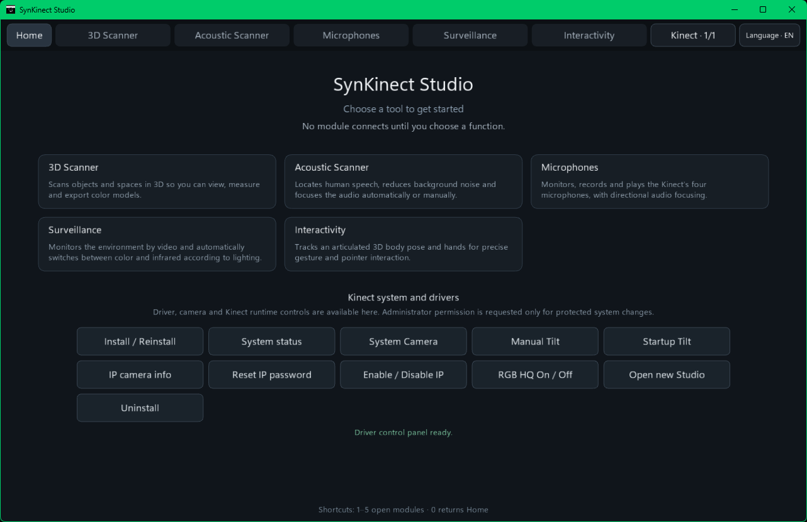
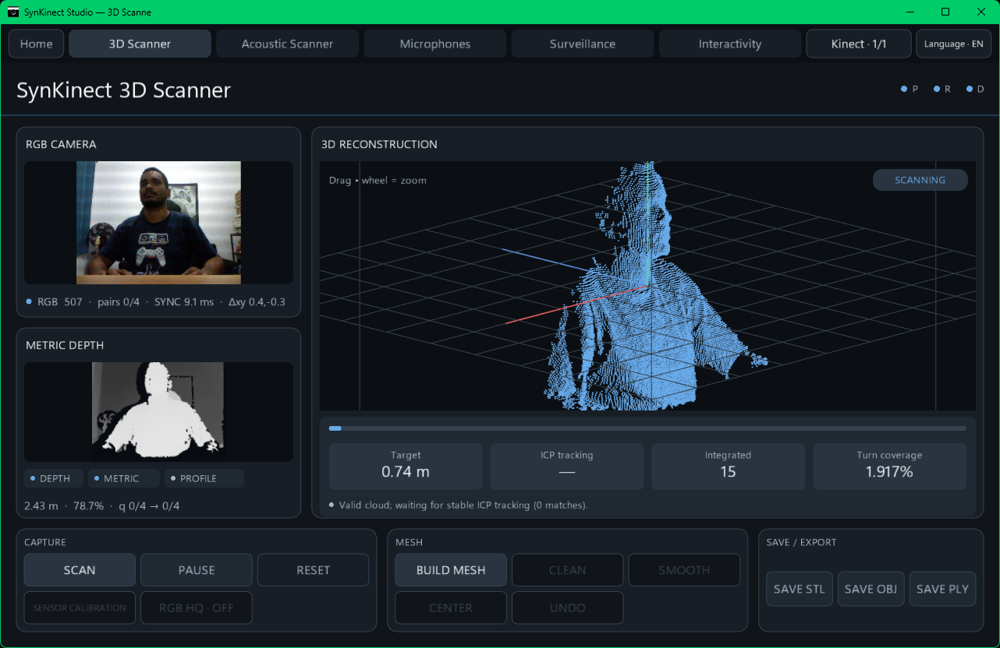
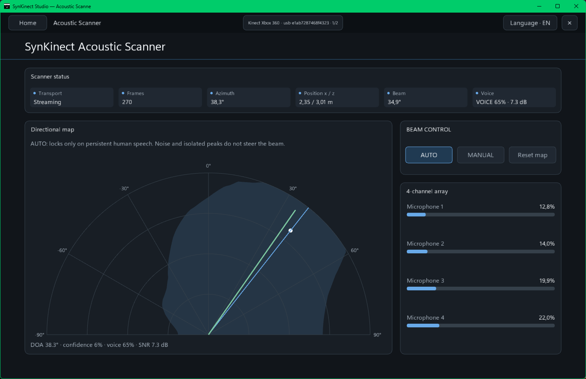
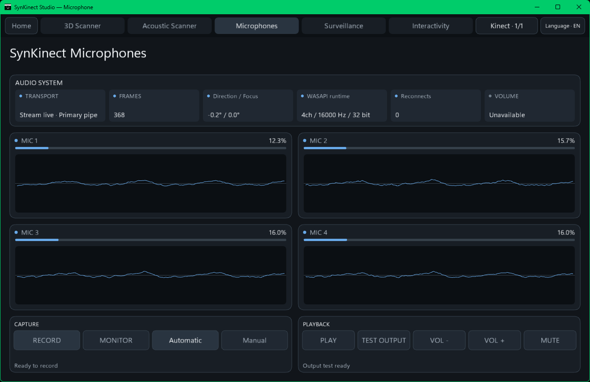
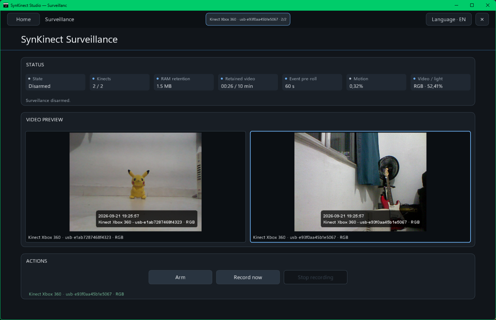
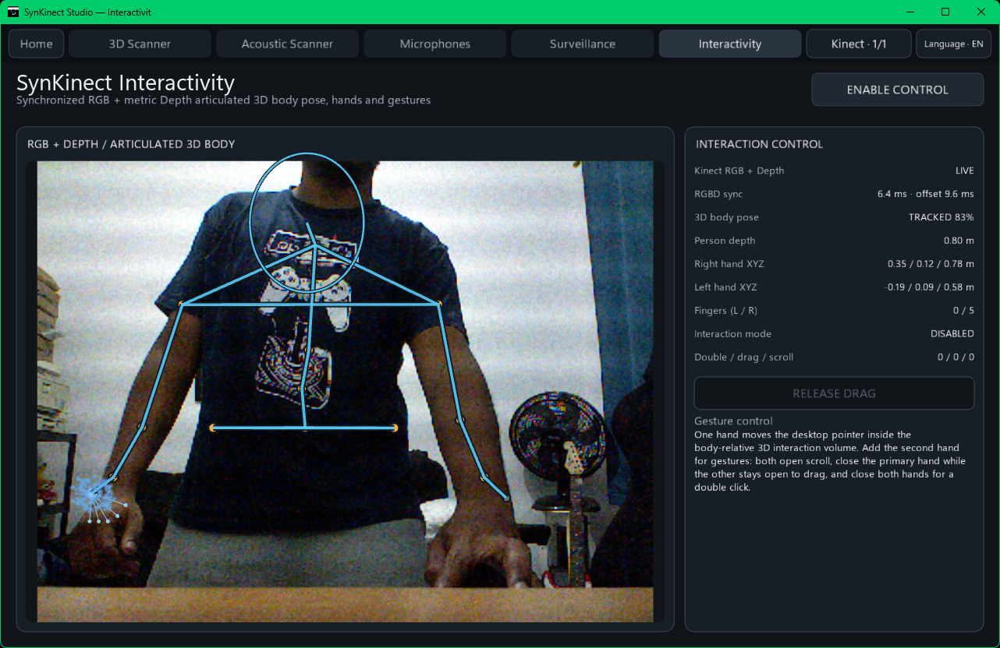

<div align="center">
  

# Kinect Xbox 360 Remold

### A modern runtime and Studio for Kinect for Xbox 360

**Models 1414 + 1473 · RGB · Depth · IR · 4-channel audio · Tilt · LED · Multi-Kinect**


[Quick start](#quick-start) · [Studio](#synkinect-studio) · [Hardware](#hardware-support) · [Architecture](#architecture-at-a-glance) · [Documentation](#documentation)

</div>

<p align="center">
  
</p>

Kinect Xbox 360 Remold gives the original Kinect for Xbox 360 a current, source-driven runtime and a unified desktop application: **SynKinect Studio**. The project targets the two major Xbox 360 sensor revisions, keeps camera/audio/control ownership explicit, and exposes the hardware through practical tools for scanning, acoustics, recording, surveillance and interaction.

## SynKinect Studio

One application, five hardware-focused modules.

<table>
<tr>
<td width="50%">
  <br>
  <b>3D Scanner</b><br>
  RGB + metric Depth reconstruction, calibration, ICP, multi-frame depth fusion, HQ TSDF and OBJ/STL/PLY export.
</td>
<td width="50%">
  <br>
  <b>Acoustic Scanner</b><br>
  Four-microphone GCC-PHAT/TDOA localization, voice gating and AUTO/MANUAL beam steering.
</td>
</tr>
<tr>
<td width="50%">
  <br>
  <b>Microphones</b><br>
  Live synchronized 4-channel capture, diagnostics, recording and beamforming controls.
</td>
<td width="50%">
  <br>
  <b>Surveillance</b><br>
  Multi-Kinect monitoring with RGB/IR day-night switching, motion detection and pre-roll retention.
</td>
</tr>
</table>

<p align="center">
  <br>
  <b>Interactivity</b> — synchronized RGB + metric Depth full-body pose with upper-body-only interactive control, hands and gestures.
</p>

### Main capabilities

| Area | V1 capability |
| --- | --- |
| Camera | Raw RGB Bayer, packed IR10 and packed Depth11 transport |
| 3D | Per-device calibration, pose refinement, loop closure, 2× multi-frame depth fusion, HQ TSDF |
| Audio | Synchronized 4-channel microphone array, GCC-PHAT/TDOA, beamforming and recording |
| Control | Tilt, LED and accelerometer through one logical 1414/1473 API |
| Surveillance | RGB/IR lighting adaptation, motion events, in-memory retention and pre-roll |
| Interaction | In-house full-body metric-depth articulated pose with upper-body-only control gating, temporal identity, geodesic limb association, biomechanical stabilization and fingertip hand tracking |
| Multi-device | Stable physical identity and independent per-Kinect runtime ownership |
| Windows integration | WinUSB camera/control, USB Audio + WASAPI, virtual camera and HTTP/MJPEG IP camera |
| Linux integration | libusb-1.0 camera/control/02AD boot over usbfs+udev, post-firmware USB Audio through snd-usb-audio/ALSA, persistent V4L2 virtual camera and NUI/SDK compatibility IPC |

## Hardware support

| Kinect model | Camera | Motor / control | Windows audio | Linux audio |
| --- | --- | --- | --- | --- |
| **1414** | `045E:02AE` | dedicated `045E:02B0` | WinUSB 02AD boot → Microsoft UAC → USB Audio/WASAPI | libusb-1.0 02AD boot → same Microsoft UAC → snd-usb-audio/ALSA |
| **1473** | `045E:02AE` behind `045E:02C2` hub | `02BB/02C3 & MI_00` after audio startup | WinUSB 02AD boot/control + USB Audio/WASAPI on `MI_02` | libusb-1.0 02AD boot/control + snd-usb-audio/ALSA on the UAC interface |

Windows uses Microsoft **WinUSB** for Kinect vendor USB functions and the inbox USB Audio/WASAPI stack for the UAC microphone interface. Linux uses the kernel USB core/`usbfs` plus **libusb-1.0** in user space for Kinect vendor functions, with udev providing access/hot-plug policy; when the audio runtime exposes UAC, `snd-usb-audio`/ALSA owns that interface instead.

## Architecture at a glance

```text
                         ┌──────────────────────────┐
                         │     SynKinect Studio     │
                         │ Scanner / Audio / Watch │
                         │     / Interactivity     │
                         └────────────┬─────────────┘
                                      │
                         ScannerPort / named pipes
                                      │
              ┌───────────────────────┼───────────────────────┐
              │                       │                       │
      ┌───────▼────────┐      ┌───────▼────────┐      ┌──────▼───────┐
      │  CameraBridge  │      │  AudioBridge   │      │    Broker    │
      │ RGB / IR / D   │      │ UAC + WASAPI   │      │ Tilt/LED/IMU │
      └───────┬────────┘      └───────┬────────┘      └──────┬───────┘
              │                       │                       │
              └───────────────────────┼───────────────────────┘
                                      │
                              Kinect Xbox 360
                               1414 / 1473
```

The camera boundary remains sensor-native. RGB demosaic, IR unpacking and metric Depth conversion are performed where they are actually consumed rather than being duplicated inside the USB transport layer.

## Quick start

### Windows 10/11 x64

Requirements: Windows 11 x64, Windows PowerShell 5.1+ and Internet access for the first build. `BUILD.cmd` discovers an existing native toolchain when present; otherwise it applies the Microsoft WDK WinGet configuration bundled with this V1 source tree, installing the current Visual Studio Community driver-development components plus Windows SDK/WDK 10.0.28000. WinGet/Visual Studio may request administrator approval during installation. If JDK 17+ is absent, the Studio build downloads, verifies and uses a portable Microsoft OpenJDK 17 automatically.

1. Extract or clone the repository into a normal writable folder.
2. Run:

```text
BUILD.cmd
```

3. The build stages the Studio runtime, downloads/verifies pinned Processing/JOGL/GlueGen dependencies, bootstraps a JDK and native Windows toolchain when missing, builds the Windows native stack and prepares the generated publication tree.
4. Run:

```text
drivers\windows\binaries\KINECT.cmd
```

5. Choose **Install / Reinstall**, then launch SynKinect Studio from the generated application runtime.

The first Kinect audio build also obtains the pinned Microsoft Kinect Runtime 1.8 package and extracts UACFirmware 01.02.709.00 locally; no Kinect SDK installation is required just to obtain that image.

### Linux x86-64

```bash
bash BUILD.sh
sudo bash drivers/linux/INSTALL.sh --direct
```

`BUILD.sh` builds SynKinect Studio and the Linux native runtime. It downloads pinned Studio dependencies, uses an existing JDK 17+ or obtains Microsoft OpenJDK 17, installs missing native build dependencies on supported distributions, obtains Kinect Runtime v1.8/UACFirmware 01.02.709.00 and compiles the runtime. Build output is written to `logs/`; when started from an interactive terminal the build window waits for Enter on success or failure so compiler errors remain visible. Use `--no-pause` for automation. `INSTALL.sh --direct` installs runtime dependencies and the completed distribution. The interactive `drivers/linux/INSTALL.sh` menu invokes the same driver build automatically when required.

The Linux system camera is published persistently through `v4l2loopback`: Remold attaches the producer before consumers enumerate the device, validates the stable `Kinect Xbox 360 Camera` label and records the actual node in `/run/kinect360-remold/v4l2-device`. `/dev/video42` is only a preference, so an existing webcam cannot make the Kinect camera disappear. RGB/IR/HQ handoff and Depth stream lifetime are managed by the camera session.

The Kinect audio runtime uses the pinned firmware image and startup sequence. During **driver compilation** it downloads the pinned Microsoft Kinect for Windows Runtime v1.8 (`1.8.0.595`), validates Runtime SHA-256 `f4d4143fb0f0a8d276889c077bfc8af42bfe99c128cadab5e316bf015a9858e9`, extracts **UACFirmware 01.02.709.00**, validates firmware SHA-256 `4467ae36ad378c58477432729d74eed0f9d45d35213f4430a781d90f64cea3f9`, and embeds those bytes into `kinect360-remold-audio`. At runtime `045e:02ad` uses the bootloader command/page/chunk/launch sequence through the host USB transport. After re-enumeration, Windows uses USB Audio/WASAPI and Linux uses the equivalent USB Audio/snd-usb-audio/ALSA capture path.

## Source layout

```text
Kinect-Xbox-360-Remold-1.0/
├── BUILD.cmd
├── BUILD.sh
├── README.md
├── VERSION
├── applications/
│   ├── processing/SynKinectStudio/     # editable Studio source
│   └── runtime-templates/              # source launchers for generated runtimes
├── drivers/
│   ├── windows/source/                 # Windows camera/audio/control/setup source
│   ├── linux/source/                   # Linux native runtime source
│   └── sdk/                            # native C/C++ application/emulator bridge
├── docs/                               # architecture, setup and protocol documentation
├── scripts/                            # build and packaging helpers
└── licenses/                           # third-party license texts
```

Generated trees such as `applications/binaries/`, `drivers/windows/binaries/`, `drivers/linux/dist/`, `.cache/` and package outputs are intentionally ignored.

## Design principles

- **One V1 architecture** — one ScannerPort protocol and one runtime path.
- **Hardware ownership is explicit** — opening or closing a Studio module does not blindly reset healthy physical transports.
- **1414 and 1473 share one logical API** — model-specific USB behavior remains inside the native backend.
- **Raw sensor data stays raw at the transport boundary** — conversion is owned by Studio or an explicit OS/network adapter.
- **Audio timing is preserved** — four microphone channels stay synchronized for TDOA/beamforming instead of being synthesized from a stereo mix.
- **Source builds are reproducible by design** — generated binaries are never repository inputs.

## Documentation

| Document | Purpose |
| --- | --- |
| [Quick start](docs/QUICKSTART.md) | Short build/install/use path |
| [Installation](docs/INSTALLATION.md) | Platform installation details |
| [Architecture](docs/ARCHITECTURE.md) | Cross-platform V1 architecture |
| [Windows architecture](docs/windows/ARCHITECTURE.md) | Windows native stack details |
| [Windows protocol](docs/windows/PROTOCOL.md) | Scanner/control/audio protocol notes |
| [UAC audio runtime](docs/windows/UAC-AUDIO-RUNTIME.md) | 1414/1473 UAC + WASAPI audio path |
| [Native builds](docs/BUILD-DRIVERS.md) | Toolchains, generated outputs and package builds |

## Credits and third-party components

The project builds against the Processing, JogAmp/JOGL/GlueGen and Microsoft components documented in [THIRD-PARTY-NOTICES.md](THIRD-PARTY-NOTICES.md) and the [`licenses/`](licenses/) directory.

---

<div align="center">
  <b>Kinect Xbox 360 Remold V1.0</b><br>
  Reviving Kinect 360 hardware with a current source-driven runtime and Studio.
</div>
