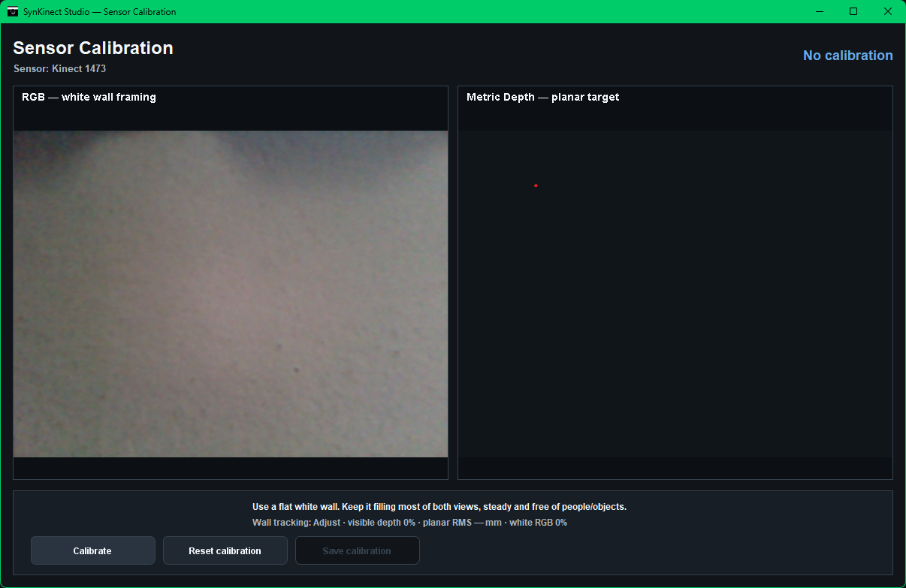

<div align="center">
  

# Kinect Remold

### A cross-generation runtime and Studio for Kinect sensors

**Models 1414 + 1473 + 1517 · Kinect v2 / Xbox One · RGB · Depth · IR · Audio · Tilt/LED where hardware supports them · Multi-Kinect**


[Documentation](docs/README.md) · [Quick start](docs/QUICKSTART.md) · [Unified device contract](docs/UNIFIED-DEVICE-CONTRACT.md) · [Architecture](docs/ARCHITECTURE.md) · [Build](docs/BUILD-DRIVERS.md)

</div>

<p align="center">
  
</p>

**by Douglas Santana · @spidoug**

Kinect Remold provides native runtimes and SynKinect Studio for first-generation Kinect models 1414, 1473 and Kinect for Windows 1517, plus Kinect v2 / Kinect for Xbox One, without storing downloaded SDKs, toolchains or generated binaries in the source tree. Windows and Linux follow the same capability-oriented runtime design—driver-module discovery, camera and audio services, per-device control, Studio integration and system image output—while the operating-system transport layer changes between WinUSB / Windows USB Audio / WASAPI / Media Foundation or local MJPEG on Windows, and libusb / native Kinect isochronous audio / ALSA / V4L2 on Linux.

Windows 11 can expose a Media Foundation virtual camera per Kinect. Windows 10 build 19041 or newer uses the loopback-only local MJPEG image backend instead. Generation-specific support is isolated into driver modules. The Xbox 360 module provides tilt, LED and four-microphone-array integration; the Xbox One module provides its native imaging transport and calibration capabilities.

### Driver modules

Source drivers live under `drivers/modules/<module-id>/`. Each module owns native transports, installation, runtime services and its public discovery endpoint. Device rows include a stable `module-id` and `generation`, so SynKinect Studio can route multiple generations concurrently without assuming one transport implementation.

Current modules: **Kinect Remold — Xbox 360** (`kinect-xbox-360-remold`, generation `xbox-360`) and **Kinect Remold — Xbox One** (`kinect-one-remold`, generation `xbox-one`).

The names `kinect-xbox-360-remold` and `kinect-one-remold` are stable technical module IDs used in generated build paths and interfaces. They are not product titles. User-facing branding and common generated product folders use **Kinect Remold**.

<table>
<tr>
<td align="center"><br><strong>Kinect Remold — Xbox 360</strong></td>
<td align="center"><br><strong>Kinect Remold — Xbox One</strong></td>
</tr>
</table>

### Platform and module overview

| Capability | Kinect Remold — Xbox 360 | Kinect Remold — Xbox One |
|---|---|---|
| Hardware | 1414, 1473, Kinect for Windows 1517 | Kinect v2 / Kinect for Xbox One |
| Windows transport | WinUSB + Windows USB Audio/WASAPI | WinUSB |
| Linux transport | libusb + native Kinect isochronous audio / ALSA | libusb |
| RGB / depth / IR | Yes | Yes |
| Native calibration metadata | Yes | Yes |
| Four-microphone Remold endpoint | Yes, 4ch @ 16 kHz | Not currently advertised |
| Tilt / LED / accelerometer controls | Yes where hardware provides them | Not applicable to v2 hardware |
| 3D Scanner / Interactivity / Surveillance | Yes | Yes for implemented imaging capabilities |
| Microphones / Acoustic Scanner | Yes | Requires a future v2 audio bridge |
| Multi-Kinect routing | Stable per-device ID | Stable per-device ID |

Both modules are available on Windows and Linux through one capability-driven Studio. A module never receives controls for hardware capabilities it does not advertise.

> The Microsoft UAC firmware is not committed to the repository. The build system obtains and verifies the required image from the official Kinect Runtime package, or accepts the exact validated image for an offline build.

## Architecture

Every connected Kinect is represented by one stable device identity. That identity binds the control transport, raw camera transport, audio transport, system image output and application endpoints for the same physical sensor.

For each connected Kinect, one stable device identity routes every capability that its driver module actually publishes. Camera/scanner operations use that identity, and SynKinect Studio enables controls only when the selected device advertises the required endpoint. The Xbox 360 module additionally publishes its four-channel audio/audio-control endpoints plus model-specific motor, LED and accelerometer controls; its LED API exposes `Off`, `Green`, `Red` and `BlinkGreen` on 1414, 1473 and 1517. The Xbox One module publishes its implemented imaging capabilities without inventing Xbox 360-only controls or an audio endpoint that is not yet implemented.

Windows uses WinUSB for Remold-owned USB transports, the Windows USB Audio stack for the Kinect UAC runtime and WASAPI for four-channel capture. On Windows 11 the RGB system output is a Media Foundation virtual camera. On Windows 10 build 19041 or newer the installer selects the local MJPEG backend automatically and binds it to `127.0.0.1` by default.

Linux uses libusb for Kinect camera/control transport, the model-appropriate native Kinect isochronous audio or ALSA path, and one v4l2loopback virtual camera per connected Kinect. All first-generation audio paths are normalized to the same four-channel Remold ABI.

## Smart virtual camera and automatic Tilt

Automatic Tilt is scoped to each Kinect independently.

On Windows 11 and Linux, the virtual camera for a Kinect tracks whether that specific virtual camera is being consumed. While active, its face tracker evaluates that Kinect's RGB stream and adjusts only that Kinect's motor through the per-device control route. Windows 10 uses the local MJPEG image-output backend; manual Tilt and all Studio tracking remain available, but the Media Foundation virtual-camera auto-framing layer is not instantiated on that platform. Accelerometer feedback, command rate limits, dead zones and motor settling limits are applied independently per sensor.

When a virtual camera is not being consumed, its face-tracking Tilt loop does not move the corresponding Kinect.

On Windows 11 and Linux, the virtual camera carries the Kinect RGB stream and follows the RGB HQ setting of its Kinect: 1280x1024 while RGB HQ is on, 640x480 otherwise. Digital pan, zoom and vertical framing follow the same face target as the motor. Windows 10 publishes RGB through the local MJPEG backend and does not instantiate the virtual-camera framing layer.

Linux and Windows run the same Smart Tilt controller and motion interface: the camera service is the only component that polls motor status (1414, 1473 and 1517 every 25 ms, only while a frame consumer is active) and every frame carries its accelerometer/tilt sample. See [`docs/MOTION.md`](docs/MOTION.md).

## IP camera

The HTTP/MJPEG runtime is secure-by-default. On Windows 11 it is an optional IP-camera feature and is disabled after a fresh install. On Windows 10 it is also the automatic local image-output backend, enabled only on `127.0.0.1`; this local loopback mode does not create a firewall rule or expose the camera to the LAN. LAN access remains an explicit administrator action. Credentials are randomly generated and hidden from normal status output. On normal enable, the stream is pinned to one stable Kinect `deviceId`, so a disconnected sensor is not silently replaced by another camera. LAN mode is limited to private/link-local peers; Windows additionally limits its firewall rule to the Private profile and LocalSubnet. Repeated failed logins are rate-limited, request sizes/routes/methods are constrained, and browser-facing responses carry restrictive security headers.

The built-in transport is authenticated HTTP, not TLS. Do not expose it directly to the public internet; use a VPN or TLS reverse proxy for access outside a trusted private network. Linux runs the IP service as a dedicated unprivileged account. Local product IPC is available immediately to the desktop session; physical USB nodes remain protected by udev/logind access control.

## Studio preferences

SynKinect Studio keeps packaged configuration and user choices separate. Locale catalogs and application defaults remain under `applications/processing/SynKinectStudio/data/`; the last language selected in the Studio and small UI preferences are stored in the operating-system user's Java preference store and are restored automatically on the next launch.

## Build output

A full build creates one root output tree:

```text
binaries/
├── windows/
│   ├── applications/
│   │   └── SynKinectStudio/
│   ├── drivers/
│   │   ├── kinect-xbox-360-remold/
│   │   └── kinect-one-remold/
│   └── sdk/
│       └── kinect-xbox-360-remold/
└── linux/
    ├── applications/
    │   └── SynKinectStudio/
    ├── drivers/
    │   ├── kinect-xbox-360-remold/
    │   └── kinect-one-remold/
    └── sdk/
        └── kinect-xbox-360-remold/
```

No generated binary is written to `applications/` or `drivers/`.

Product-owned generated and installed folders use the common **Kinect Remold** root. On Windows, build cache/work data lives below `%LOCALAPPDATA%\Kinect Remold\`, shared runtime state below `%ProgramData%\Kinect Remold\`, and persistent generation runtimes below `C:\Program Files\Kinect Remold\<module-id>\`. Linux uses XDG `kinect-remold` user storage and conventional technical module locations such as `/usr/libexec/kinect-one-remold`. The module IDs remain lowercase/hyphenated because they are stable machine-facing identifiers, not branding.

## Windows build

Double-click or run:

```bat
Kinect-Remold.cmd
```

If any required binary is missing, the launcher builds the complete Windows runtime and Studio. When all artifacts are ready it starts the native `SynKinectStudio.exe` application and the build Command Prompt exits.

The build downloads verified build dependencies into:

```text
%LOCALAPPDATA%\Kinect Remold\Cache\windows
```

and keeps temporary work outside the repository under:

```text
%LOCALAPPDATA%\Kinect Remold\Work\windows
```

The generated runtime control entry point is:

```text
binaries\windows\drivers\kinect-xbox-360-remold\KINECT.cmd
```

SynKinect Studio is generated under:

```text
binaries\windows\applications\SynKinectStudio\
```

## Linux build

Run or launch `Kinect-Remold.sh`. If required binaries are missing it builds the complete Linux runtime and Studio; otherwise it opens Studio directly. From a graphical desktop, a terminal is used only while a build is actually required. Missing build dependencies are detected before compilation and can be installed through the native `apt`, `dnf` or `pacman` package manager after the normal administrator prompt. If compilation fails, the build terminal remains open and reports the failing stage and log path; after a successful build, the launcher verifies that SynKinect Studio actually starts before closing the build terminal.

The Xbox 360 Windows installation procedure follows the complete driver transaction implemented in the project’s canonical GitHub installer (`Spidoug/Kinect-Remold`). The control panel captures the verbose installer stream and presents only the operation result and final runtime status; no PnP, audio-firmware, camera, service, identity, trust, or verification stage is skipped. Linux maintenance follows the same quiet-console rule while retaining its complete native installation sequence.

The Linux launcher builds the runtime when required, and `INSTALL.sh` installs only the generated bundle. Hardware routing is model-specific: model 1414 uses the dedicated `045E:02B0` motor function; model 1473 leaves `045E:02C2 REV_0001` as the parent hub and uses runtime `02BB/02C3 MI_00`; model 1517 uses its dedicated `045E:02C2 REV_0100` control function and factory `045E:02BE` USB-audio runtime.


<table>
<tr>
<td align="center"><br><strong>Windows</strong></td>
<td align="center"><br><strong>Linux</strong></td>
</tr>
</table>

Windows and Linux intentionally present the same maintenance vocabulary and final health model. The native installation transactions differ, but both end by validating the Studio-facing device capabilities rather than treating an installed service as proof of hardware readiness. See the [unified device contract](docs/UNIFIED-DEVICE-CONTRACT.md).

The Linux build is also the provisioning boundary: it prepares the verified UAC firmware and compiles the pinned `v4l2loopback` module for the running kernel. `Install / Reinstall` and `binaries/linux/drivers/kinect-xbox-360-remold/INSTALL.sh` perform no download, package-manager operation or compilation; they install and verify only the already-built bundle.

```bash
bash Kinect-Remold.sh
```

Temporary build work is kept outside the repository under the XDG cache location, or under `REMOLD_WORK_ROOT` when explicitly configured.

The generated runtime control entry point is:

```text
binaries/linux/drivers/kinect-xbox-360-remold/KINECT.sh
```

SynKinect Studio is generated under:

```text
binaries/linux/applications/SynKinectStudio/
```

## Firmware

Windows obtains and verifies the Microsoft Kinect Runtime 1.8 package during the driver build and extracts the required `UACFirmware` into build work outside the source tree.

Linux uses the same UAC runtime model. `UACFirmware` is not committed to this repository. During a full Linux build, the official Microsoft Kinect Runtime v1.8 package is downloaded into the user cache, verified, and the exact UAC firmware image is extracted and verified before it is placed in the generated runtime support directory. `KINECT_UAC_FIRMWARE` remains available for an offline build with the exact validated image.

## Driver-module SDK discovery

Each driver module publishes a native endpoint interface, not a copy of a Microsoft Kinect SDK. The current Kinect Remold — Xbox 360 module uses:

Windows:

```text
\\.\pipe\Kinect360RemoldSdk
```

Linux:

```text
/run/kinect360-remold/sdk.sock
```

Both transports implement `LIST`, `GET <deviceId>` and `INDEX <sensorIndex>`. Rows are `id, label, state, control, camera, audio, audio-control, virtual-camera, sdk, module-id, generation, capabilities, color-width, color-height, depth-width, depth-height, ir-width, ir-height, color-fps, depth-fps`. SynKinect Studio queries every registered driver module and merges devices by `module-id + deviceId`; runtime manifests remain private to each native module. Each SDK output also publishes the public control and audio-control ABI headers for its platform.

## Source layout

```text
applications/   SynKinect Studio source, resources and module API source
drivers/        generation-specific native driver modules
scripts/        top-level Studio and native-runtime build entry points
docs/           architecture, installation and protocol documentation
licenses/       repository license material
Kinect-Remold.cmd  Windows module build + Studio launch entry point
Kinect-Remold.sh   Linux module build + Studio launch entry point
```

See `docs/QUICKSTART.md`, `docs/ARCHITECTURE.md` and `docs/BUILD-DRIVERS.md` for the operating model and build details.

## Multi-generation Studio capabilities

SynKinect Studio is capability-driven. Driver modules identify their generation and advertise color/depth/infrared dimensions, frame rates and generation-specific controls. The Xbox 360 and Xbox One modules remain isolated under their own module directories, while the Studio routes both through the shared device registry without exposing Xbox 360-only controls to Kinect v2.


## Kinect Remold — Xbox One

`drivers/modules/kinect-one-remold` integrates Kinect v2 / Kinect for Xbox One through the project-owned native USB transport. Windows talks directly to Microsoft WinUSB (`winusb.sys`/WinUSB API) and Linux talks directly to libusb-1.0/udev. No alternate Windows USB runtime is required. The module uses the same generation-neutral SynKinect Studio discovery interface as the Kinect 360 module. Device discovery and USB ownership are implemented; image capabilities are published only when a real per-device streaming endpoint is available.

The Xbox One module follows the same installed-runtime ownership rule as the Xbox 360 module: build artifacts stay in the repository, while persistent services run only from operating-system installation locations. Windows uses `C:\Program Files\Kinect Remold\kinect-one-remold`; Linux uses `/usr/libexec/kinect-one-remold` plus `/usr/share/kinect-one-remold/maintenance`. The source repository can be moved or deleted after installation without breaking the persistent runtime or leaving source files locked by a service.


### Sensor calibration

The Studio's **Sensor calibration** system action opens a standalone RGB + metric depth calibration window. It guides planar white-wall capture, stages the result for review, reports Good / Regular / Poor / No calibration with coverage and RMS, and provides explicit Calibrate, Reset calibration, and Save calibration actions. See `docs/SENSOR-CALIBRATION.md`.

<p align="center"></p>

### Windows / Linux Studio parity

The same SynKinect Studio module code runs on Windows and Linux. Linux maps the transport layer to AF_UNIX sockets, V4L2 and ALSA while Windows maps it to named pipes, native camera output and WASAPI. Scanner, Surveillance, Interactivity/Body3D and Sensor Calibration use the same camera/depth/IR protocol on both systems; Microphones and Acoustic Scanner use the same four-channel audio protocol for Kinect Xbox 360-class devices. System-control terminals now use the same module/action framing and status vocabulary on both operating systems. See `docs/linux/RUNTIME.md`.

## Interactivity and Body3D

Interactivity tracks the current 20-joint body model directly in calibrated metric depth. The segmented body cloud continuously anchors body scale, torso length, shoulder/hip span and limb proportions; anatomical region locks and same-side cloud support keep elbows, wrists, hands, knees, ankles and feet attached to the correct body region. During short occlusions, per-joint velocity and the articulated chain predict the missing joint with decaying confidence, and fresh region-compatible depth evidence is required before it returns to a measured state.

Torso-relative depth layering separates arms/hands that pass in front of the trunk or overlap another limb in the camera view. Lower-body samples do not become arm candidates merely because their image coordinates line up with a lowered hand; Body3D requires compatible foreground depth, anatomical side, articulated reach and temporal continuity. The axial model also preserves measured human-scale torso and leg proportions so temporary missing depth cannot collapse the lower body.

Display framing is deliberately independent from acquisition. The Interactivity frontend fits a bounded metric envelope instead of chasing the instantaneous joint box: seated/partial poses are allowed to render substantially larger, full-body poses retain a human-scale minimum, and fast envelope growth such as a raised arm triggers a faster zoom-out while zoom-in remains delayed. SynSkeleton person segmentation scans the complete depth frame, and the presentation cloud also scans the full frame before applying torso-relative 3D discovery bounds, so presentation zoom cannot hide a limb from tracking or visualization. See [`docs/SKELETON-3D-ARCHITECTURE.md`](docs/SKELETON-3D-ARCHITECTURE.md).

## Surveillance RGB / IR stability

Surveillance uses RGB in normal light and IR in low light. Entry and exit use separate luminance thresholds plus frame confirmation. After an automatic RGB/IR transition, the selected mode is held for at least 60 seconds before another automatic probe or transition is allowed; motion detection and recording continue during the hold. Manual control and transport recovery are not treated as ordinary automatic light-mode decisions.

## Clean source-tree policy

Source packages intentionally do not contain a pre-created `binaries/` directory. `binaries/` is a generated publication target recreated by the build scripts when needed. Build caches, downloaded dependencies, logs and intermediate objects live outside the repository or in ignored build locations. Runtime templates under `applications/runtime-templates/` are authored source inputs and remain versioned.

The source tree is maintained as a first-distribution codebase: installers target only the current `Kinect Remold` locations, no pre-release directory migration branches are shipped, ambiguous hardware associations are rejected instead of guessed, and duplicated cross-platform implementation files are consolidated when they represent the same algorithm. The supported Windows camera compatibility path remains intentional platform behavior rather than historical compatibility code.

The 3D Scanner and Interactivity frontends share `StableViewportFilter`, while each viewport owns an independent filter instance. This keeps tracking/reconstruction metric data separate from display framing and provides the same deadband, asymmetric zoom response, delayed zoom-in and center stabilization policy without duplicated implementations.

Installed services are fully detached from the repository: Windows runs Remold services from `C:\Program Files\Kinect Remold\...` or the Windows Driver Store, and Linux runs them from `/usr/libexec/...` with state under `/var/lib/...`. The repository is only a build/install source and can be moved or removed after installation.


## Hardware-operation audit

See [`docs/DRIVER-MODEL-AUDIT.md`](docs/DRIVER-MODEL-AUDIT.md) for the per-model Windows/Linux runtime invariants.


### Kinect 1414 transport validation

The model 1414 control and microphone paths are documented in [`docs/DRIVER-1414-AUDIO-CONTROL.md`](docs/DRIVER-1414-AUDIO-CONTROL.md). Linux uses the native Kinect v1 isochronous microphone transport for 1414, while Windows validates the actual WinUSB control endpoint before reporting physical control READY.
