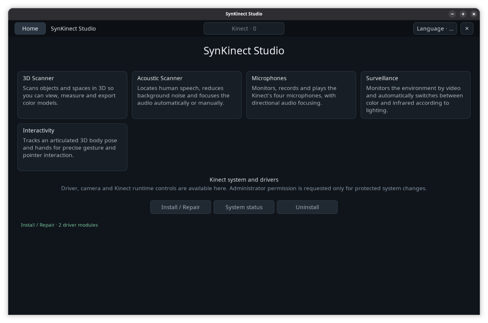

## Frontend language and visual consistency

Built-in modules use the shared Studio UI vocabulary and renderer: sentence-case labels, a common `Status` summary panel, consistent state words, verb-first action labels, unified hover/selected button feedback, and host-owned native file/folder dialogs. Proper technical abbreviations such as RGB, USB, ICP, IMU, HQ, WASAPI, STL/OBJ/PLY and XYZ retain their conventional capitalization. See [`docs/STUDIO-UI-STYLE.md`](../../../docs/STUDIO-UI-STYLE.md).

<div align="center">

# SynKinect Studio

### Capability-driven desktop Studio for Kinect Remold runtimes

[Project overview](../../../README.md) · [Documentation](../../../docs/README.md) · [Module SDK](../../studio-module-sdk/README.md)

</div>

`SynKinectStudio.pde` is the Processing application entry point for the Kinect Remold project. The Studio includes five hardware modules and can load additional modules in the same window:

- **3D Scanner** — turntable scanning is isolated by a locked metric **Bounding Box / Volume Of Interest** in camera space. The first coherent target component establishes the box; after lock, background outside it is discarded before tracking and the rotating base may remain inside the volume. Registration uses robust 6-DoF ICP with a turntable yaw seed plus optional synchronized RGB correspondence weighting (Color-ICP). Geometry remains authoritative, while texture on the object/base helps disambiguate repeated or weak geometry. Before TSDF fusion, observed voxels plus accepted-cloud history reject displaced duplicate shells. Only accepted fusion poses advance coverage and the HQ archive.
- **Acoustic Scanner** — four-microphone band-limited SRP/GCC-PHAT localization with per-pair reliability weighting, temporal source tracking, voice activity detection, adaptive noise suppression and conservative AUTO/MANUAL beamforming to the system playback output.
- **Microphones** — four-channel monitor, runtime status and recording, with its own instance of the same voice-aware DOA/noise-suppression/beamforming engine used by Acoustic Scanner.
- **Surveillance** — all-connected-Kinect adaptive video surveillance: RGB in normal light or IR in low light, never Depth, with hysteretic light-mode selection, a minimum 60-second automatic mode hold, appearance/luminance motion detection, a compressed 10-minute RAM ring per camera and synchronized internal MJPEG/AVI event recording.
- **Interactivity** — 20-joint Kinematic Fusion over metric Depth, with stable identity, cloud-scale body fitting, anatomical per-limb support, confidence-aware occlusion prediction/reacquisition, anthropometric stabilization, independent 2/3-body visual framing, persistent Auto/Right/Left hand selection and precision body-relative 3D desktop interaction on Windows and Linux.

<p align="center">
  
</p>

The current Home surface presents the five built-in modules—**3D Scanner**, **Acoustic Scanner**, **Microphones**, **Surveillance** and **Interactivity**—as capability cards. Below them, the **Kinect system and drivers** section exposes **Install / Repair**, **System status** and **Uninstall** without mixing protected system operations into the individual sensor tools. Administrator permission is requested only when a protected system change actually requires it. Current captures for Home and every built-in module are maintained under `docs/images/`, so the project overview and technical documentation share the same visual source.

Open modules from the Home cards. The top bar is intentionally limited to Home, Kinect selection and Language so every module receives the same navigation shell. Home uses an automatically flowing card grid backed by a scroll viewport: built-in and newly loaded modules are inserted with the same title/description cards, the grid chooses its column count from the available width, and the mouse wheel or draggable scrollbar reaches additional rows without moving the shell title. The Kinect system/driver controls follow the module grid at their natural content height instead of reserving a large empty panel. All built-in modules use the shared `StudioUi` component system for panels, metric blocks, buttons, status footers, responsive spacing and localization-safe text fitting while preserving the established appearance: one single-line module header followed by titled cards for previews, status and action/control groups. Specialized preview canvases remain module-owned, while reusable front-end controls and resize behavior are host-owned. Interactive buttons stay inside action/control panels instead of floating in or below the header. The top-level Kinect control selects the device used by single-camera modules and shows the detected model plus the selected/total count, for example `Kinect 1473 · 2/2`. An explicit selector change is treated differently from an automatic reconnect: it immediately drops frames from the previous sensor, closes that sensor's active module transports and reconnects Scanner, Interactivity, Acoustic and Microphones to the newly selected stable `device-id`. The device registry lists physical sensors independently of camera-endpoint readiness; a sensor may remain selectable while its video transport is re-enumerating, and video-dependent modules wait for that sensor's endpoint instead of removing the sensor from the Studio. **3D Scanner and Interactivity each open their own RGB + metric-Depth session for the selected Kinect.** Xbox 360 uses its native 640×480 profile; other generations allocate previews and processing buffers from the dimensions advertised by their driver module and frame headers. Surveillance is deliberately different: while the module is active it monitors every device in the central registry concurrently. RGB and raw IR share one physical Kinect video engine. Foreground Surveillance owns that arbitration and subscribes exactly one video stream: RGB in normal light or IR in low light. It never subscribes Depth. Leaving the Surveillance module disarms it and releases video ownership so Scanner/Interactivity are not blocked.


## Multi-generation device model

SynKinect Studio registers Kinect driver modules independently. The current registry contains `kinect-xbox-360-remold` (`generation=xbox-360`) and `kinect-one-remold` (`generation=xbox-one`); future generations can add another module endpoint without replacing or aliasing either runtime. Devices are keyed internally by `module-id + native device-id`, while module-independent features consume advertised camera, control, audio and SDK capabilities. External Studio modules receive the same qualified identity through `StudioDeviceInfo`.

## Instance-owned Studio runtime

`SynKinectStudio.pde` keeps the Processing callbacks only as the required `PApplet` host boundary. The Studio itself is a `StudioController` instance that owns the built-in and loaded `StudioModule` instances. Each module has instance lifecycle methods for initialization, activation, deactivation, drawing, input and disposal. Protocols, themes, transports, UI objects and the 3D viewport are also normal object instances; the PDE contains no `static` declaration.

Module switching is asynchronous. The render/UI thread only requests a target module; a dedicated lifecycle worker releases the current native transport and activates the latest requested module. Rapid module changes are coalesced, so blocking pipe/socket shutdown and worker joins never run in the Processing draw/input thread.

Scanner and Interactivity use independent camera transport instances. They reuse the same calibration math, but never share a live RGBD connection. Leaving either module invalidates and closes its transport immediately; the superseded worker retires by session generation and cannot stop a newly opened module. Interactivity consumes only its newest RGB + metric-Depth pair and sends immutable snapshots to a separate tracking worker, keeping the Processing render thread free of camera I/O and heavy CV work.

Surveillance owns all discovered Kinect video streams only while the module is active. Leaving Surveillance disarms monitoring, stops any active event asynchronously and releases RGB/IR ownership so Scanner or Interactivity cannot be blocked by a hidden video consumer. While active, every discovered Kinect owns an independent RGB-or-IR subscriber, appearance/luminance motion detector and compressed JPEG retention ring in RAM. When Surveillance is already in IR mode and motion is confirmed, it immediately attempts a bounded RGB probe; usable color keeps RGB active, while darkness, a failed RGB subscription or a probe timeout automatically restores IR. Ambient-light recovery remains a slower secondary RGB probe path. The default ring is **10 minutes** and every event flushes **60 seconds of pre-roll** per camera before appending live frames. Motion from any camera starts one global event containing one compact MJPEG/AVI file per connected Kinect. The AVI writer is part of the Studio and starts no external encoder process.


## Application-local language and data layout

Language selection is global in `StudioController`/`StudioShellI18n`. The top bar contains exactly three aligned controls: Home, the centered Kinect selector, and Language. Module names are not duplicated in the top bar; modules are opened from Home. The configured order is `en-US`, `pt-BR`, `es-ES`, `fr-FR`, `de-DE`, `it-IT`, `ja-JP` and `zh-CN`. **English (`en-US`) is the package default.** Chinese uses Simplified Chinese (`zh-CN`). On a first launch with no saved preference, the Studio starts explicitly in English (`en-US`), independent of the operating-system locale. After the user selects a language, that choice is stored in the operating-system user preference store and restored on subsequent launches. The Studio uses Java's Unicode-capable logical sans-serif family so Latin, Cyrillic and CJK text share one typography system with platform font resolution.

Resources are separated by application instead of sharing one monolithic catalog. Each built-in application owns its configuration and locale package:

```text
data/
  studio/
    config.properties
    i18n/<locale>.properties
  scanner/
    config.properties
    i18n/<locale>.properties
  acoustic/
    config.properties
    i18n/<locale>.properties
  microphones/
    config.properties
    i18n/<locale>.properties
  surveillance/
    config.properties
    i18n/<locale>.properties
  interactivity/
    config.properties
    i18n/<locale>.properties
```

Generated data is stored in the current user's writable application-data area, separate from packaged `data/` resources. On Windows the default root is `%LOCALAPPDATA%/Kinect Remold/Data/SynKinect Studio/`; on Linux it is `$XDG_DATA_HOME/Kinect Remold/Data/SynKinect Studio/` or `~/.local/share/Kinect Remold/Data/SynKinect Studio/`. Scanner exports/calibration, Microphones recordings, Surveillance events and external-module output are created below that root. `-Dkinect.remold.userData=<path>` overrides the root. Small user-interface preferences that must survive application upgrades, including the selected language and Interactivity control hand, use the Java user preference store.

## Responsive typography

`studioUiScale()`, `studioTypographyScale()`, `responsiveFontSize()`, `fitCurrentTextSize()` and `ellipsizeToWidth()` are the shared typography policy. Base font size follows the actual window dimensions with a dedicated viewport-aware typography scale. Text that lives inside a finite control is then fitted against that control's real width/height, with an ellipsis only if the configured minimum size still cannot fit. Buttons, cards, metrics, pills, status rows and Interactivity fields use this policy.

## Module visual ownership

The host owns structural UI rules: content width, panel columns, panel/button/metric maximum widths, gaps, responsive typography and generic hit testing. Built-in and external modules therefore receive the same spacing behavior without module-name exceptions. A module owns only specialized visualization and domain presentation that cannot be expressed with the shared `StudioUi` components. Built-ins may define domain-specific button labels/actions, but their geometry is delegated to the same layout engine used by declarative external modules.

## Shared RGB-D session

`RgbdCore.pde` exposes an independent RGB-D session boundary for modules that need synchronized RGB and metric depth. A module owns its own session and can select a Kinect without depending on another module's lifecycle. Shared frame types live at this boundary so future modules can consume RGB-D data without importing Scanner UI or Scanner state.

## Shared spatial-audio library

`SpatialAudio.pde` is the shared per-Kinect spatial-audio runtime used by the built-in audio modules. Exactly one `SpatialAudioDeviceSession` owns the raw 4-channel transport, frame decode, localization and human-voice/VAD analysis for each `device-id`; Acoustic Scanner and Microphones attach as independent consumers of that same immutable frame/analysis stream. Each consumer may still instantiate its own beamformer/noise-suppression output state, so playback choices never feed back into capture/VAD. Shared tuning lives in `data/spatial-audio/config/config.properties`. Additional modules can attach to the same per-device session without opening a second microphone transport.

## Shared SynSkeleton library

Body tracking is implemented in `Skeleton.pde` as **SynSkeleton**, a Studio-wide library rather than an Interactivity-only subsystem. `StudioServices.skeletons` exposes a reusable `SkeletonLibrary`; any built-in module can create an independent `SkeletonTracker` with `studio.services.skeletons.createTracker(calibration, rgbRegistration)`. Each tracker owns its temporal history, person identity, learned anthropometry and occlusion state, so trackers may be instantiated independently for different modules or Kinect devices. Shared tuning lives in `data/skeleton/config/config.properties`.

A tracker consumes calibrated metric Depth directly, or an `RgbdFramePair`, and returns a `SkeletonPose3D` using the canonical Kinect Xbox 360/NUI 20-joint topology. Arm fitting accepts overhead elbow/wrist/hand evidence across the full anatomical upper-body range; distal-joint reacquisition uses motion-aware local support and short inferred holds so fast arm elevation does not collapse the chain after a single weak depth frame. The pipeline combines robust metric-depth person segmentation, calibrated 3D point-cloud body-frame estimation, volumetric anatomical region fitting, floor-aware lower-body stabilization, depth-supported joint refinement, temporal identity affinity, a coherent articulated motion prior, motion-adaptive median/MAD consensus, a depth-aware constant-velocity Kalman stage, confidence-aware One-Euro-style filtering, innovation and velocity gates, coherent torso/root stabilization, bounded bilateral anthropometric learning, iterative articulated-body constraint optimization, direction constraints and short occlusion prediction. Body3D is the only pose solver; the previous silhouette/geodesic solver and its recovery path have been removed. Body acquisition depends on body/torso evidence and core-joint coverage rather than hand quality; `interactionTracked()` is a separate stricter gate for modules that require a usable hand. Acquisition evidence accumulates with hysteresis instead of resetting after a single weak frame, and after a sustained miss the person segmenter broadens its search instead of remaining locked to a stale predicted location.

Every joint stores image coordinates, camera-space XYZ metres, confidence and tracking state. `SkeletonPoseFilter` uses joint-class motion limits so torso anchors remain stable while hands, wrists, feet and other extremities remain responsive. `SkeletonAnthropometricModel` learns symmetric limb proportions only from high-confidence measurements and bounds outlier observations before they can change learned bone lengths. `SkeletonTemporalConsensus` rejects isolated joint spikes before low-pass filtering, while `SkeletonRootStabilizer` applies a coherent body translation instead of allowing independent filters to make the torso shimmer. The public pose is exactly the Kinect Xbox 360/NUI 20-joint model: HipCenter, Spine, ShoulderCenter, Head and the bilateral shoulder/elbow/wrist/hand/hip/knee/ankle/foot joints. Hands are ordinary terminal joints; the tracker does not infer fingers, palm landmarks, pinch or grab states. The integrated driver package does not expose a NUI skeleton relay socket, so SynSkeleton remains an in-Studio service for built-in/external Studio modules and the optional publisher stays disabled.

## Interactivity pipeline

The Interactivity module acquires the Kinect **full-FOV metric Depth** stream and does not request RGB or IR. It instantiates SynSkeleton through the shared library and adds interaction-specific behavior on top: metric-depth preview, skeleton visualization, hand selection and desktop pointer control. Body tracking and pointer geometry are driven by calibrated metric Depth. The full-body skeleton remains available to other modules even though desktop interaction deliberately requires only torso, shoulders, arms and hands. Interaction uses only 20-joint joint positions: forward hand motion controls press/drag, a simultaneous two-hand push produces a double click, and two-hand vertical motion controls scrolling. No finger detection or finger counting is required.

The RGB preview remains a clean camera image; skeleton rendering and interaction feedback live only in the dedicated 3D body viewport. Body3D derives a torso-relative depth layer from the segmented 3D cloud, so arms passing in front of the chest or over another limb remain separable by metric depth even when their 2D projections overlap. Lower-body points are prevented from becoming lowered hands/arms unless depth, side, bone-length and temporal evidence agree. The 3D presentation is host/frontend state: a bounded metric envelope adapts to full-body, seated, upper-body and partial tracking, uses a rapid expansion path when limbs move toward an edge, and deliberately delays contraction. The module backend continues to publish metric pose/cloud state and never receives viewport scale or center as tracking input. Joints are rendered only when supported by current depth evidence or bounded short-term tracking continuity. The interactive-control gate is deliberately upper-body capable: torso identity, shoulders, arms and hands can drive pointer/gesture input when legs are outside the frame or occluded. Pointer coordinates are derived from a shoulder/torso-aligned 3D body frame rather than raw image pixels or camera-global axes. A confidence-aware precision filter adds stationary jitter rejection, bounded outlier jumps and small velocity prediction so fine pointing remains steady without making fast movements sluggish. The active hand and cursor mapping are visualized in the 3D viewport. The control-hand button cycles **Auto → Right → Left**; Auto uses confidence, forward reach and hysteresis, and the selection is stored in the operating-system user preference store. Losing tracking, disabling control or changing modules releases held input state.


## Compact Surveillance video

Each connected Kinect owns an independent ScannerPort endpoint and remains visible in the Studio device selector while its physical identity is present. The Windows installer requires the Remold private camera interface on every physical `02AE`; generic WinUSB alone is not treated as a complete camera installation. The Broker SDK is the Studio discovery source. The runtime refreshes its internal device manifest continuously, and the Studio tolerates a 30-second SDK reconnect interval before removing a previously observed device. During that interval the device state becomes `reconnecting` and no stale camera endpoint is advertised. This prevents normal 02AD→02BB/02C3 firmware re-enumeration, 02AE PnP rebinding or a CameraBridge service restart from collapsing the complete multi-Kinect list. Surveillance renders all connected cameras in a grid and records one AVI per camera inside the same event directory.

For concurrent live streams, USB host-controller bandwidth remains a hardware constraint. Kinect Xbox 360 was specified around a dedicated USB 2.0 bus; when several sensors share one controller, Windows can reject or starve isochronous bandwidth even though all sensors are correctly enumerated. In a multi-Kinect installation, CameraBridge therefore keeps each inactive sensor at zero streaming bandwidth and closes the physical RGB/Depth session when that sensor has no ScannerPort or virtual-camera consumer. Selecting another Kinect releases the previous session before the new sensor retries its stream. Separate root USB controllers/PCIe USB controllers are still recommended when several sensors must stream simultaneously.

Surveillance writes to the per-user `surveillance/recordings/event-YYYYMMDD-HHmmss/kinect-<device-id>.avi` with Motion JPEG plus an `event.properties` manifest. Video compression and AVI indexing are implemented inside the Studio; FFmpeg is not used. The pre-roll source is the in-memory compressed ring; temporary camera disconnects preserve already-retained frames and a reconnect with the same stable device ID rejoins the same event recorder.

## Window-close safety

Keyboard shortcuts are not used by the built-in Studio modules. Processing's default ESC-to-exit path is disabled so accidental key input cannot close the application. The JOGL native window uses `DO_NOTHING_ON_CLOSE`, and all close requests are routed through the Studio policy. If Surveillance is armed or recording, the close request is rejected and a localized warning is shown. After Surveillance is disarmed, the same close button exits normally.

## Window resize and pointer coordinates

The Studio opens at **1440×900** and enforces that same size as its minimum resizable window. Shared `StudioUiSystem` axis allocators distribute panel groups within the exact available rectangle, shrink gaps before content, and only compress component minima as the final layout step; child button and metric grids never reserve geometry outside their host panel. The Studio uses the normal operating-system frame and title bar. It deliberately does not call `GLWindow.setUndecorated()`, hide/show the native peer, or recreate the window after startup; moving, resizing, minimizing and maximizing are handled by the OS. The internal Studio top bar continues to provide application navigation, device selector, language control and its orderly close action. The shell reserves the top `STUDIO_TOP_BAR_H` pixels for navigation and renders each module after translating the canvas into content space. Pointer input uses the inverse transform exposed by `StudioController.contentMouseX()/contentMouseY()`; modules must not read global `mouseX`/`mouseY` directly for content controls.

## 3D viewport containment

The 3D Scanner reconstruction environment is rendered by an instance-owned off-screen `PGraphics(P3D)` viewport. Grid, axes, point cloud and mesh are rendered into that buffer and then composited into the reconstruction card as one image. This prevents camera/projection/depth state from leaking into the Studio renderer or drawing outside the panel. The viewport is recreated to match the actual panel dimensions after a window resize, so the UI follows the generated window size rather than a fixed design-time height.

## Application icon

The SynKinect Studio icon asset is maintained with the application source. The sketch contains Processing export icon sizes (`icon-16.png` through `icon-512.png`), keeps `data/studio/resources/synkinect-studio-icon.png` as the runtime window icon, and embeds the same PNG in the unified application JAR as an application resource. The full Kinect hardware reference image is kept separately under `../../../docs/images/`. Windows is packaged as a native `jpackage` application image. Linux stages the runtime script, PNG icon and `.desktop` entry from `../../runtime-templates/`. Build artifacts are created under the build output tree; application-generated data is kept in the owning per-user application-data directory.

## RAW camera boundary

ScannerPort uses GRBG8 Bayer RGB, packed 10-bit IR and packed 11-bit Depth. The Studio rejects decoded camera wire formats instead of selecting alternate decoders. RGB demosaic, IR unpack/crop and calibrated Depth conversion are performed in the module-side processing layer. Module objects are instantiated independently at startup, but transports remain closed until the corresponding module is activated.

## Linux/Processing runtime interface

The application uses one local transport implementation for Windows named pipes and Linux Unix-domain sockets. Transport shutdown is idempotent and actively closes both input and output sides so worker threads do not remain blocked while changing modules or closing the program.

## 3D scanner low-latency pipeline

Scanner buffering is bounded and prioritizes current capture data:

1. the native camera bridge keeps bounded FIFO queues per RGB/IR/depth stream;
2. `KinectSource` keeps bounded RGB/depth synchronization history and publishes synchronized `RgbdFramePair` objects;
3. the Processing render loop drains several available pairs per tick, while preview metrics and RGB preview conversion are paid only for the newest drained pair;
4. active reconstruction keeps a small bounded latest-frame window and drops the oldest pending reconstruction item if fusion falls behind;
5. ICP tracking is restricted to the locked 3D Bounding Box. When synchronized RGB is available, calibrated RGB-D color similarity contributes a bounded correspondence weight; if RGB is unavailable or out of sync, tracking automatically falls back to depth-only ICP;
6. TSDF reset/initialization runs on the reconstruction worker; **Scan** does not clear the reconstruction volume on the Processing render/UI thread.

Queue sizes and drain rate are configurable in `data/scanner/config/config.properties`. The real-time profile uses a 4-frame reconstruction window, 8 published RGBD pairs and 10 synchronization-history frames while preserving the configured 192³ TSDF volume. Native and Processing frame numbers are monitored so transport gaps are visible instead of being silently hidden.

A completed angular sweep does not automatically trigger final reconstruction. The single **Scan** control is stateful: it starts a new capture, becomes **Pause** while capture is running and becomes **Resume** while paused. **Build mesh** always uses retained RGB-D keyframes: it performs offline global pose recovery and fuses a fresh TSDF instead of trusting visible realtime point-cloud alignment. Until the configured minimum keyframe count is available, mesh generation remains unavailable. **Refine HQ** runs the same global recovery at the high-quality profile, with higher-resolution fusion, depth super-resolution and final polish; it is not a cosmetic smoothing step. Tracked turn progress is updated from every valid ICP pose independently of TSDF acceptance; the fused-sector strip and 360° completion remain gated by frames actually integrated into the volume. During Scan, the 3D viewport stays in point-cloud mode: accepted ICP-aligned frames accumulate into a bounded voxel preview and the current aligned frame is overlaid transiently. Live mesh extraction and automatic mesh finalization are disabled during capture; Build Mesh / Refine HQ are explicit transitions. **Clean**, **Smooth** and **Center** act only on the current mesh (or first create a safe TSDF snapshot if no mesh exists), while **Undo** restores the previous mesh edit. Export actions operate on the visible mesh and build one automatically when only fused geometry exists. Disabled controls remain safe but report why the requested action is unavailable. Capture, calibration, mesh processing and export cannot mutate Scanner state concurrently.

## High-quality final reconstruction

The 192³ TSDF remains the low-latency preview used while the object/base rotates inside the locked Bounding Box. When `quality.enabled=true`, usable full RGB-D keyframes are retained separately even if realtime fusion rejects their current pose. **Build mesh** globally re-registers those retained frames and rebuilds a fresh standard-resolution TSDF; **Refine HQ** repeats the corrected reconstruction with the HQ TSDF, depth super-resolution and final polish. Frames that cannot reach local geometric consensus are excluded instead of being baked into the output.

### Scanner color transport

The live Scanner keeps 640×480 metric Depth as its geometry baseline. RGB resolution is owned by the selected Kinect driver instance: when **RGB HQ** is enabled in the Studio system/driver panel or through `KINECT`, the Scanner follows that setting and consumes the native 1280×1024 Bayer color stream without changing Depth geometry. High-quality reconstruction continues to use calibration, robust registration, multi-view fusion and the HQ TSDF build; if the HQ transport stalls, the camera session is restarted without silently changing the selected RGB mode.


## Compact mesh export

The Save action uses the host-owned native dialog service and suggests `SynKinectScan.stl`, `.obj` or `.ply`. On Windows this is the native Explorer/Win32 save dialog; Linux uses the native desktop chooser available on the host.

Exports run outside the capture/render thread. The save dialog starts in the user's writable Scanner output directory, the selected extension is enforced, the destination directory is validated before writing and a zero-length/missing result is treated as an export failure. Before writing, the mesh is converted to an indexed representation, nearby vertices are welded, degenerate/duplicate faces are removed and triangle count is bounded with conservative geometric clustering. PLY is binary little-endian. OBJ stores indexed geometry, normals and the RGB vertex colors accumulated from the Kinect scan itself. STL remains binary and uses the compacted face set.

Important export settings in `data/scanner/config/config.properties`:

```properties
export.weldToleranceM=0.0010
export.maxWeldToleranceM=0.004
export.maxTriangles=600000
```

Increase `export.maxTriangles` or reduce `export.weldToleranceM` when maximum geometric detail matters more than file size.

Surveillance uses an adaptive per-frame JPEG budget (10 KiB by default at 320×240 / 5 fps), targeting roughly **2.9 MiB per minute** before small AVI container overhead while retaining standard MJPEG/AVI playback.

### Scanner sensor options

The Scanner capture bar exposes **SENSOR CALIBRATION** only; it does not own RGB HQ state. Per-device depth calibration is enabled by default and learns per-pixel correction/noise confidence from multiple flat-wall distances; this improves use of valid depth samples but cannot create measurements inside the physical sensor's invalid/zero-depth region. RGB HQ is a persistent per-Kinect driver setting controlled from the Studio system/driver panel or `KINECT`. The Scanner follows that setting. On Windows 11 the native virtual-camera output renegotiates its advertised format when clients reopen; Windows 10 uses the local MJPEG image backend instead.

The Remold 20-joint stream uses Kinect Xbox 360 joint ordering. `ShoulderCenter` is the shoulder-midline anchor and `HipCenter` is the pelvis midpoint; the Linux skeleton relay completes partial socket writes so slow consumers remain connected. The Remold NUI ABI is an project runtime interface; it is not binary impersonation of Microsoft's Kinect SDK and does not make an Xbox 360 console game accept a PC-hosted sensor automatically.

## Module API 1

External modules implement `org.synkinect.studio.api.SynKinectStudioModule` and are discovered from trusted JAR files in the packaged `modules/` directory through Java `ServiceLoader`. The public API is maintained under `applications/studio-module-sdk/` and is built as `SynKinectStudio-module-api.jar`.

The Studio registry treats built-in and external modules through the same string identity and lifecycle interface. Runtime active/ready checks for built-in hardware state use instance identity rather than fixed navigation indexes or module-name comparisons. The host dispatches language, Kinect-selection, input and close-policy behavior through generic lifecycle/context interfaces: initialized modules receive `StudioContextEvent` notifications and decide internally how their own resources react. Module state is installed in a type-keyed instance store rather than fixed fields in `StudioController`, so adding another built-in state type does not change the controller.

Built-in modules remain first in navigation. Loaded modules receive `StudioModuleContext`, which provides the Processing host, locale, device snapshots, per-Kinect audio/control endpoints, public Remold endpoints, local transport access, per-module data storage, logging and managed workers. New modules can be backend-only: returning a declarative `StudioModuleUi` lets the host build and resize panels, metric blocks, buttons, status areas and hit targets automatically. The current module API provides generic context-change, mouse-release and close-guard hooks. The loader accepts only the current API version. Custom `draw()` remains optional for specialized graphics. Module JARs execute in the Studio process with the Studio user's operating-system permissions.

### Folder selection and generated data

Scanner STL/OBJ/PLY actions always open the host-native save-file chooser and remember the last export folder. Microphones and Surveillance use the same host-owned native dialog service for recording-directory selection. On Windows, directory selection is delegated to the Windows Shell/Explorer; on Linux the frontend requires an installed native chooser, `zenity` or `kdialog`. The chooser is opened without a forced initial directory, so the operating system is free to present its normal/recent location instead of always starting in Downloads. Selected destinations are still stored as per-user preferences for subsequent recordings without changing packaged configuration.

### Generation capabilities

Device discovery accepts optional capability and stream metadata after the base SDK columns: `capabilities, color-width, color-height, depth-width, depth-height, ir-width, ir-height, color-fps, depth-fps`. Xbox 360 publishes its fixed profile. The Kinect Remold Xbox One module publishes its native camera profile and only capabilities implemented by its runtime. The Home hardware controls are built from the selected device capabilities rather than the generation name. Tilt, startup tilt, RGB-HQ, IP, calibration and camera actions appear only when the selected runtime advertises the capability required by that action. Generation remains transport metadata, not a UI permission list. RGB previews allocate from the received frame size, and the RGB-D transport accepts native metric 16-bit Depth in addition to the Xbox 360 RAW11 path. For Kinect One, Scanner and Interactivity negotiate synchronized RGB + Depth + IR; IR is used as additional confidence evidence by the Scanner/Body3D path while Surveillance may request IR directly. Native Kinect One depth intrinsics are applied dynamically at the received 512x424 geometry, so deprojection and ICP do not reuse Xbox 360 640x480 assumptions. The Kinect One camera runtime does not advertise audio because that path is not implemented there.

### Module/plugin architecture

Studio modules are optional plugins. The five modules shipped in the source tree use the same `StudioModuleBase` lifecycle registry and can be removed from the shell with `studio.modules.enabled` in `data/studio/config/config.properties`. The default is `scanner,acoustic,microphones,surveillance,interactivity`; removing an id prevents that module from being instantiated. No shell feature may rely on a module's array position.

Installable third-party modules remain JAR plugins discovered from the Studio `modules` directory through `SynKinectStudioModule`. They may be added or removed without changing the shell source. Built-in and JAR modules share setup, activate, deactivate, draw, input, context-change and dispose lifecycle semantics; external JARs additionally receive an isolated `StudioPluginContext` and tracked worker cleanup.


## Host-owned frontend / backend-oriented modules

Reusable presentation belongs to the Studio host. `StudioUiSystem`, `StudioUiModuleFrontend`,
`StudioUiPanel`, `StudioUiButton`, `StudioUiMetric`, `StudioUiRenderer` and `StudioNativeDialogs` define responsive
layout, panel chrome, typography, interaction feedback, capability-aware controls, status/location
footers, native save/folder selection and visualization framing. Built-ins retain their characteristic Scanner/radar/meters/
surveillance/body content while instantiating the common frontend. File/folder dialogs are therefore a frontend service, not a module-specific implementation detail.

External JAR modules can remain backend-oriented through `StudioModuleUi`. The public API now
also supports `StudioModulePanel.Visual` plus `StudioModulePanel.visual(...)`: a plugin publishes
an immutable ARGB frame and the host owns clipping, fitting and presentation. Direct Processing
drawing remains compatible, but declarative host-rendered UI is the preferred path for new modules.


### Reusable frontend toolkit

The declarative plugin frontend additionally provides host-rendered progress bars, tables,
forms/fields, logs and spacers alongside text, metrics, actions and ARGB visual frames. This gives
future adapters (including Python processes) enough primitives to build useful modules without
shipping a second GUI toolkit. Module-specific visualization remains possible through visual
frames while the Studio retains layout, typography, interaction and theme ownership.

See `applications/studio-module-sdk/PYTHON-PLUGIN-BRIDGE.md` for the intended process/IPC boundary.


### Body3D and scanner precision

Interactivity uses articulated 3D cloud gating so the displayed depth spheres belong to the tracked body volume, then applies bounded cloud-to-joint fusion after biomechanical optimization. The 3D Scanner rejects locally unstable depth samples and uses reciprocal robust ICP before TSDF integration.
