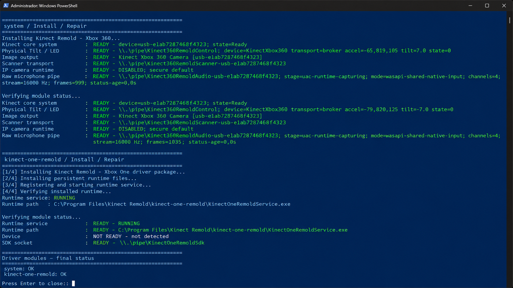
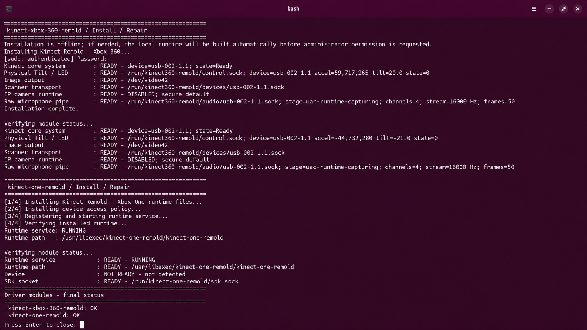

<div align="center">

# Installation

> Windows and Linux installation differ internally but converge on the same device-health semantics. See [Unified Kinect device contract](UNIFIED-DEVICE-CONTRACT.md).

### Install generated Kinect Remold runtimes without mixing build artifacts into the source tree

[Documentation](README.md) · [Quick start](QUICKSTART.md) · [Build](BUILD-DRIVERS.md) · [Compatibility](KINECT-COMPATIBILITY-MATRIX.md)

</div>

Kinect Remold separates **building** from **installing**. Build tools may download verified dependencies into user cache/work locations, while installation consumes only the generated bundle under `binaries/`.

## Windows

1. Build with `Kinect-Remold.cmd` when required.
2. Use SynKinect Studio **Kinect system and drivers** for normal install/repair/status actions, or run a generated module installer directly when diagnosing a generation-specific problem.
3. Allow administrator elevation only when Windows needs protected driver/service changes.

Generated module bundles are published at:

```text
binaries\windows\drivers\kinect-xbox-360-remold\
binaries\windows\drivers\kinect-one-remold\
```

Persistent runtimes use one product root:

```text
C:\Program Files\Kinect Remold\kinect-xbox-360-remold\
C:\Program Files\Kinect Remold\kinect-one-remold\
```

Shared machine state uses `%ProgramData%\Kinect Remold\`, while build cache/work data uses `%LOCALAPPDATA%\Kinect Remold\`. The installer does not disable Secure Boot or Windows signature enforcement. The Xbox 360 runtime uses Microsoft inbox WinUSB and USB Audio facilities together with Remold user-mode services; Windows 11 uses the Media Foundation virtual-camera path and Windows 10 build 19041 or newer uses the local MJPEG image backend. The Xbox One module owns its separate WinUSB image transport.


## Linux

1. Build with `bash Kinect-Remold.sh`.
2. Install the generated module bundle required for the hardware:

```bash
sudo binaries/linux/drivers/kinect-xbox-360-remold/INSTALL.sh
sudo binaries/linux/drivers/kinect-one-remold/INSTALL.sh
```

3. Start SynKinect Studio from its generated desktop launcher or `SynKinectStudio.sh`.

The generated installers are offline installation boundaries: dependency resolution and compilation happen before installation. Linux keeps stable technical module paths such as `/usr/libexec/kinect360-remold` and `/usr/libexec/kinect-one-remold`; user cache/state/data folders use the `Kinect Remold` product directory below the applicable XDG root.

### Linux maintenance output

Linux maintenance uses one presentation layer at a time. When an action is started from SynKinect Studio, the Studio owns the action header and the module scripts run without a second banner. When a module control script is executed directly, it shows one `Kinect Remold - Linux control panel` header.

`Status` is informational: an installed runtime with no Kinect attached reports `Device: NOT DETECTED` without treating that absence as a driver failure. A resident module SDK endpoint may remain `READY` because the service is installed and waiting for hot-plug. After uninstall, the service/SDK endpoint are expected to be absent. Xbox One and Xbox 360 status commands therefore distinguish runtime availability from physical-device presence.

## Generation modules

**Kinect Remold — Xbox 360** covers Kinect 1414, 1473 and Kinect for Windows 1517, including its generation-specific audio, tilt, LED and accelerometer capabilities.

**Kinect Remold — Xbox One** covers Kinect v2 / Kinect for Xbox One imaging through its own WinUSB/libusb transport. It advertises only capabilities implemented by that runtime; Xbox 360-only controls are never exposed as cross-generation guarantees.

The source/build repository may be moved or deleted after installation because persistent services run only from installed operating-system locations, never from the repository tree.

## Reinstall and recovery

A reinstall should be performed through the generated platform installer rather than by manually replacing individual binaries. This keeps driver package, service, endpoint and certificate state synchronized.

For build-stage failures, use the [Build guide](BUILD-DRIVERS.md) before changing installed device state. Build logs are kept outside the authored source tree under the platform work directory.


## Reference console output

<table>
<tr>
<td align="center"><br><strong>Windows</strong></td>
<td align="center"><br><strong>Linux</strong></td>
</tr>
</table>

A successful first-generation installation is expected to finish with core, physical control, image output, Scanner transport and raw microphone transport operational. The optional IP camera may remain `DISABLED` by secure default. Kinect v2 is judged only against the capabilities its module actually advertises.
