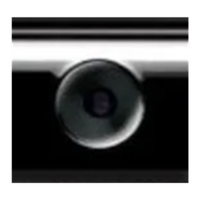
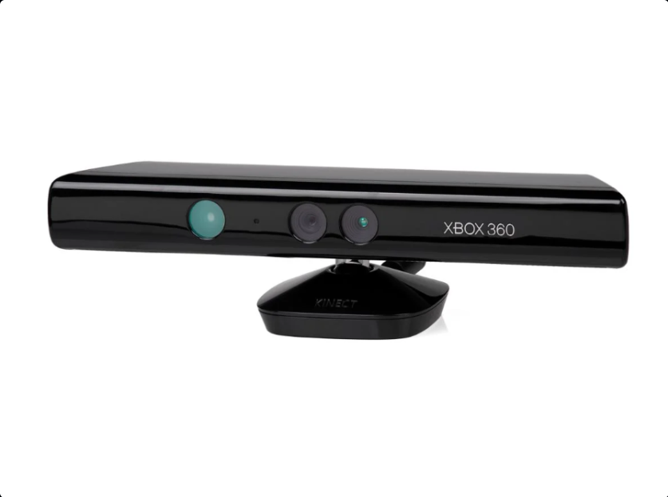
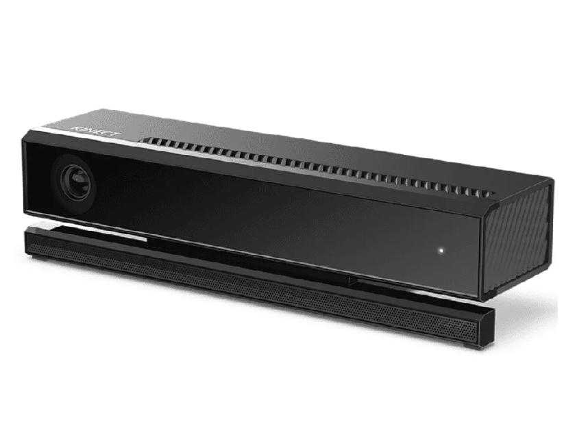
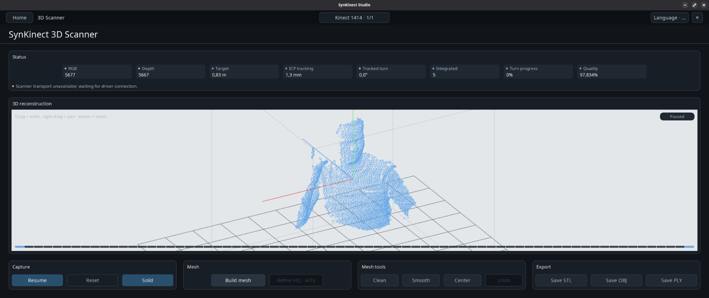
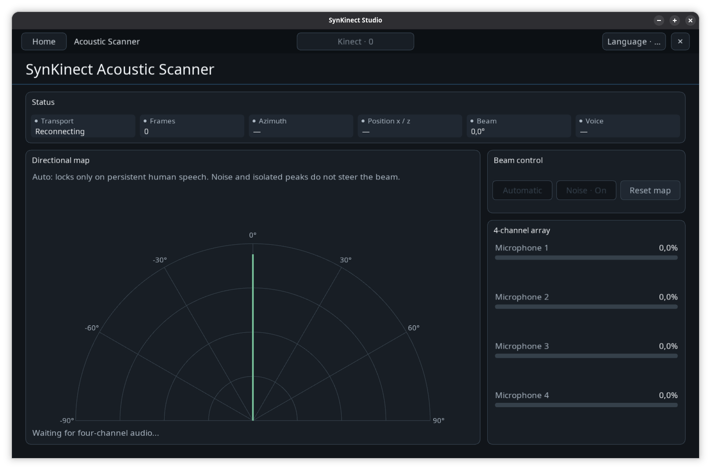
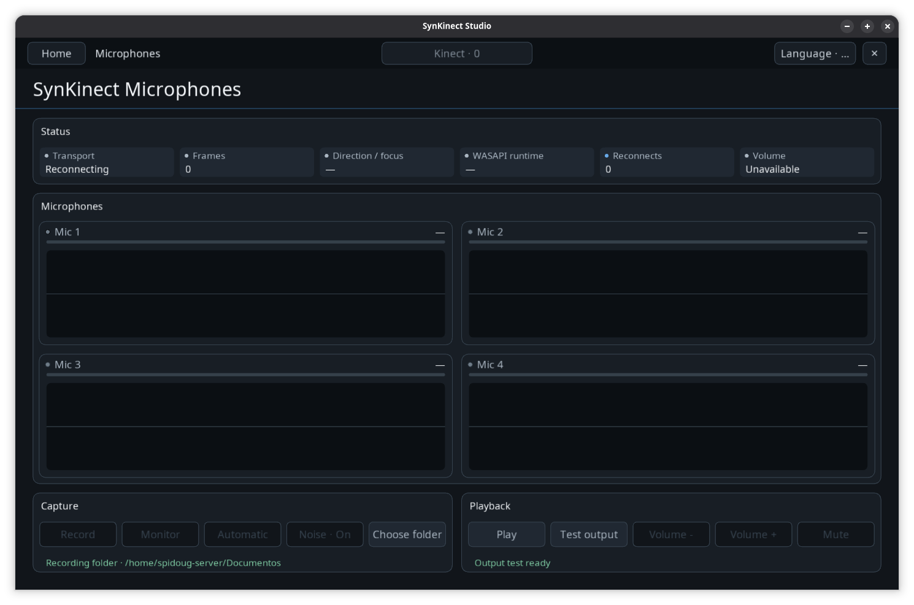
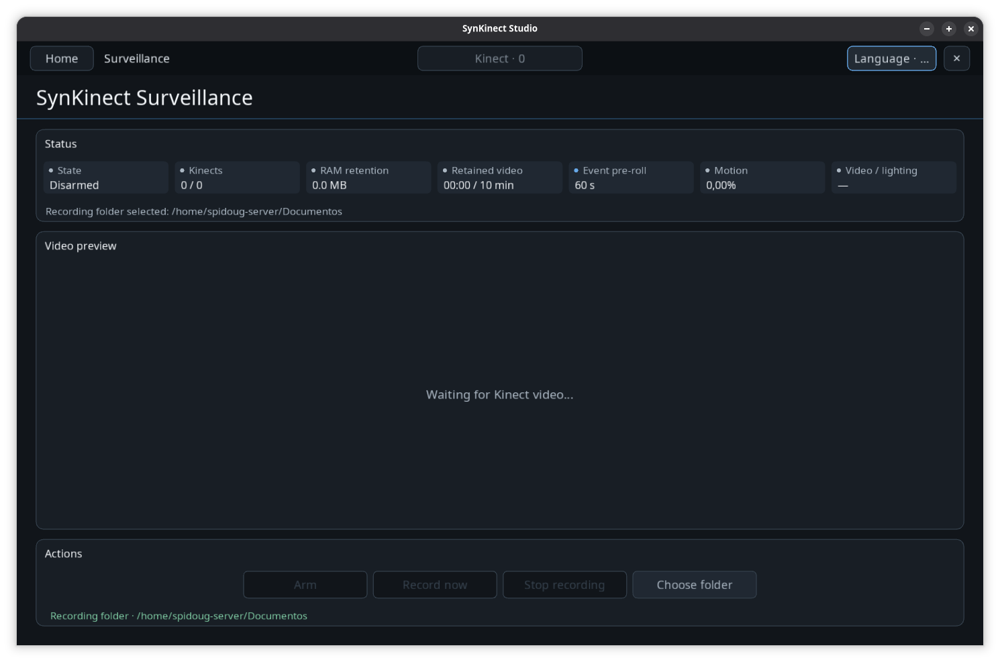
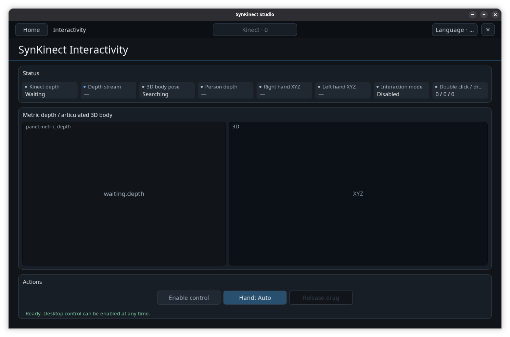

  

# Kinect Remold Documentation

### Runtime, hardware, Studio and developer reference

**Kinect 1414 + 1473 + 1517 · Kinect v2 / Xbox One · Windows + Linux · Native runtime · SynKinect Studio**

[Quick start](QUICKSTART.md) · [Installation](INSTALLATION.md) · [Architecture](ARCHITECTURE.md) · [Build](BUILD-DRIVERS.md)

  

This directory is the engineering and user documentation for Kinect Remold. Start with the shortest path that matches what you are doing, then move into platform or subsystem references only when you need implementation detail.

## Start here

| Goal | Document |
|---|---|
| Build and run quickly | [Quick start](QUICKSTART.md) |
| Install generated runtime packages | [Installation](INSTALLATION.md) |
| Understand ownership, data flow and process boundaries | [Architecture](ARCHITECTURE.md) |
| Build drivers and Studio from source | [Build](BUILD-DRIVERS.md) |
| Compare Kinect models and supported capabilities | [Compatibility matrix](KINECT-COMPATIBILITY-MATRIX.md) |
| Understand the common cross-model user contract | [Unified device contract](UNIFIED-DEVICE-CONTRACT.md) |

## Sensor and Studio

- [Studio module behavior](STUDIO-MODULE-BEHAVIOR.md) — final runtime behavior of Scanner, Acoustic Scanner, Microphones, Surveillance, Interactivity, calibration, external modules and resource ownership.
- [Studio UI language](STUDIO-UI-STYLE.md) — shared capitalization, state vocabulary, button behavior, native dialogs and frontend consistency rules.
- [Motion / Smart Tilt](MOTION.md) — accelerometer, tilt lifecycle, per-frame motion samples and automatic framing behavior.
- [Sensor calibration](SENSOR-CALIBRATION.md) — RGB + metric-depth calibration workflow and quality reporting.
- [Scanner 3D viewport](SCANNER-3D-VIEWPORT.md) — navigation, partial-mesh workflow and coordinate integrity.
- [SynSkeleton 3D architecture](SKELETON-3D-ARCHITECTURE.md) — 20-joint topology, cloud-scale fitting, anatomical support, occlusion recovery and runtime boundaries.
- [Module layout](MODULE-LAYOUT.md) — driver-module and Studio-module directory organization.

## Windows runtime

- [Windows architecture](windows/ARCHITECTURE.md)
- [Protocol reference](windows/PROTOCOL.md)
- [UAC audio runtime](windows/UAC-AUDIO-RUNTIME.md)
- [Microphone endpoint](windows/WINDOWS-MICROPHONE-ENDPOINT.md)
- [Raw sensor lifecycle](windows/RAW-SENSOR-LIFECYCLE.md)
- [Acoustic Scanner](windows/ACOUSTIC-ENVIRONMENT-SCAN.md)
- [IP / MJPEG runtime](windows/IP-CAMERA-RUNTIME.md)

## Linux runtime

- [Driver/runtime](linux/RUNTIME.md)
- [Direct libusb backend](linux/USB-BACKEND.md)
- [IP camera runtime](linux/IP-CAMERA-RUNTIME.md)

## Supported Kinect generations

<table>
<tr>
<td align="center"> <strong>Kinect first-generation Remold</strong> Models 1414 + 1473 + 1517</td>
<td align="center"> <strong>Kinect Remold — Xbox One</strong> Separate generation module</td>
</tr>
</table>

The first-generation Remold module covers 1414, 1473 and Kinect for Windows 1517 with RGB, IR, depth, four-channel microphone capture, tilt, LED, accelerometer and multi-device routing. Kinect Remold — Xbox One is isolated in its own driver module and provides the complete Remold v2 sensor-imaging pipeline for Kinect v2 / Kinect for Xbox One.

The first-generation models deliberately share one user contract: when healthy, 1414, 1473 and 1517 expose the same Studio modules and the same control/audio semantics even though their native USB topology differs. Kinect v2 joins the same capability-driven workflow for the imaging features it implements. See [Unified Kinect device contract](UNIFIED-DEVICE-CONTRACT.md).

## Installation/status appearance

<table>
<tr>
<td align="center"> <strong>Windows</strong></td>
<td align="center"> <strong>Linux</strong></td>
</tr>
</table>

The console layout is intentionally parallel across platforms: action header, compact operation output, capability status, and one final module summary. Platform-specific driver details remain in logs unless they are needed to diagnose a failure.

## SynKinect Studio

The Studio uses one shared shell for device selection, language, responsive panels and module navigation. Home exposes the five built-in modules as capability cards and keeps driver maintenance in a dedicated **Kinect system and drivers** area with **Install / Repair**, **System status** and **Uninstall** actions. Each module owns its specialized visualization while reusing the same status, action and control language across Windows and Linux.

<table>
<tr>
<td align="center"> <strong>3D Scanner</strong> Metric RGB-D reconstruction, mesh generation and export.</td>
<td align="center"> <strong>Acoustic Scanner</strong> Four-channel localization, voice activity and beam control.</td>
</tr>
<tr>
<td align="center"> <strong>Microphones</strong> Per-channel monitoring, recording and playback controls.</td>
<td align="center"> <strong>Surveillance</strong> Multi-Kinect RGB/IR monitoring and event recording.</td>
</tr>
<tr>
<td colspan="2" align="center"> <strong>Interactivity</strong> Metric articulated body tracking and 3D desktop interaction.</td>
</tr>
</table>

