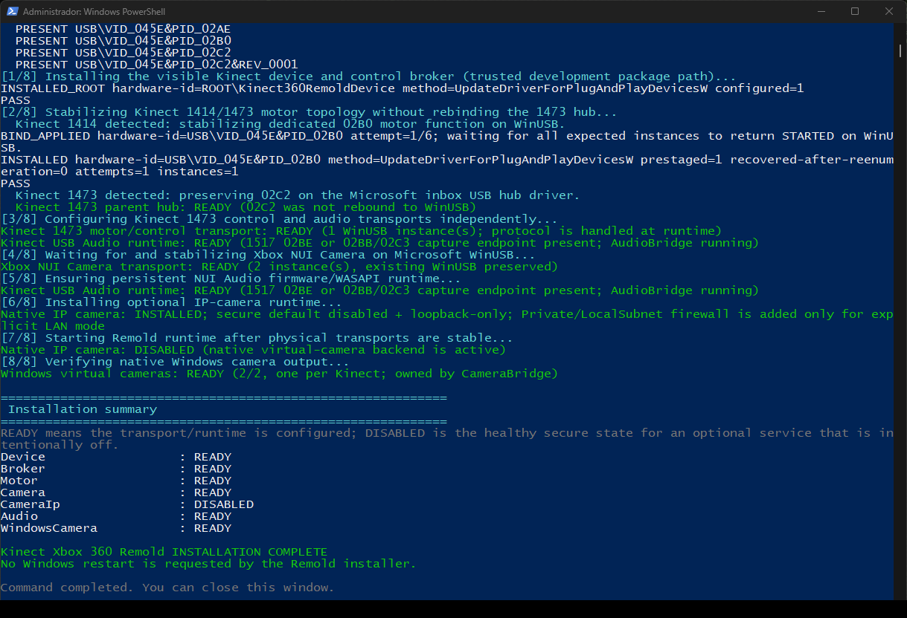

<div align="center">


# Kinect Xbox 360 Remold — Windows

### Native Windows runtime for models 1414, 1473 and Kinect for Windows 1517

[Driver modules](../../../README.md) · [Windows architecture](../../../../docs/windows/ARCHITECTURE.md) · [Build](../../../../docs/BUILD-DRIVERS.md)

</div>

**by Douglas Santana - @spidoug**

<p align="center"></p>

The Windows driver/runtime source lives entirely under `source/`. Generated driver payloads are produced by the build.

## Build environment

- Windows 10 x64 build 19041 or newer; Windows 11 uses the native virtual-camera backend automatically;
- Visual Studio/MSBuild with the current Microsoft desktop driver-development components;
- Windows SDK/Driver Kit 10.0.28000;
- PowerShell 5.1 or newer.

Build:

```text
Kinect-Remold.cmd --build-only
```

The builder compiles the current source and publishes only to the repository-root `binaries\windows\drivers\kinect-xbox-360-remold\` directory. It builds the per-device/multi-client camera bridge with RGB-HQ support, motor/device broker, audio bridge, Windows 11 virtual-camera source, Windows 10/11 MJPEG image runtime, setup tools and PnP package artifacts.

The generated driver directory is recreated by the build and is ignored by source control. Build intermediates, downloads and logs remain outside the source tree.

After a successful build, run:

```text
..\..\binaries\windows\drivers\kinect-xbox-360-remold\KINECT.cmd
```

and choose Install / Reinstall.

The native architecture uses Microsoft inbox WinUSB/USB Audio facilities and user-mode Remold services. See `BINARY-PAYLOAD.md`, `../../docs/BUILD-DRIVERS.md` and `../../docs/windows/ARCHITECTURE.md`.

## Camera stability policy

The physical Kinect color engine always starts in the proven 640×480 RGB mode. Scanner 3D uses RGB 640×480 + Depth as its default live transport. IR is selected only by a real IR consumer. RGB-HQ remains an isolated Scanner capability and is never requested by the Windows virtual camera or by Studio startup.

On Windows 11 the native virtual camera is a read-only consumer of the shared RGB stream and has no authority to change the physical Kinect mode. On Windows 10 the automatic loopback MJPEG backend consumes the same mapping and has the same no-control boundary.

## Kinect for Windows 1517

Model 1517 is identified by its `045E:02BF` camera. Its dedicated motor/control function is bound only through the revision-scoped `USB\VID_045E&PID_02C2&REV_0100` package, keeping the 1473 `02C2 REV_0001` hub on the Microsoft hub stack. The factory `045E:02BE` USB-audio function is associated with the same physical device and captured through the shared WASAPI AudioBridge.